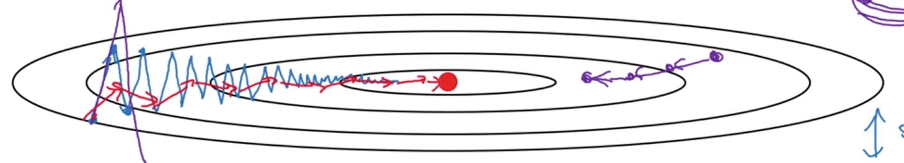

# Coursera_dl 
## Neural network and deep learning
#### week1:
  * overall for neural network and deep learning.
  * interview to Geoffrey Hinton
#### week2:
  + Python basic
    + Avoid use for-loop or while loop in computation to some extend. Try best to make matrix computation.
    + Using numpy function to complete matrix/vector computation.
    + Matrix/vector operated by numeric would be "broadcasting"
  + 0-layer logistic regression(only a activation node) 
    + if just make a simple logistic regression, w and b can be initialized in "zero" vector. But for multi-layer neural network w can't be initialized as "zero". The reason would be introduced in next section.
    + Different learning rate would influence performance deeply.
#### week3: 
  * Implement a simple 1-layer NN
     - Compared with previous logistic regression, 1-layer NN can solve some non-linear separable problem.
     - W must be initialized by a random normal. It is because that assigning different weights to each node in hidden layer can trigger them to learn different decision boundary. If initializing zero or same weight to each weight, it would result to a balance where each node learns same decision boundary, and then the whole network would be same with only on node. 
          But, b can be initialized as "zero". Zero is related with training data.
      - The loss function is chosen as cross-entropy for logistic activation. Here, the square loss + logistic would become as a non-convex which has many local minima. 
      - Cost function = averaging(loss function). Cost function would involve in back-propagation. 
      - Learning rate, hidden layer size and number of nodes are hyper-parameter. Kinds of method can be used to choose them. Try them by your self.
#### week4:
  - Deep neural network: step by step
    - The difference from shallow neural network is just using loop to finish forward and back propagation.
    - Cultivate yourself for a good writing habit. 
        - Superscript $[l]$ denotes a quantity associated with the $l^{th}$ layer.
            Example: $a^{[L]}$ is the $L^{th}$ layer activation. $W^{[L]}$ and $b^{[L]}$ are the $L^{th}$ layer parameters.
        - Superscript $(i)$ denotes a quantity associated with the $i^{th}$ example.
            Example: $x^{(i)}$ is the $i^{th}$ training example.
        - Lower-script $i$ denotes the $i^{th}$ entry of a vector.
            Example: $a^{[l]}_i$ denotes the $i^{th}$ entry of the $l^{th}$ layer's activations).
  - Activation function choose:
        - Logistic regression: 
          Just for last layer for binary classification. Almost no ones choose it as activation function in hidden lay.
        -  Tanh: 
        better than logistic because the median point locates in right zero, but logistic locates in 0.5. 
        - Relu: 
        most used in current days. High speed even it is not differential, but still works well. 
        - Leaky relu: 
        just a transform for relu when w less than zero, multiply a small number to w.              
 
 		Don't be lazy and do by yourself.
## Hyperparameter_tuning, regularization and optimization
#### week1:
- Initialization
  - Zeros initialization
    - As said before, the symmetry can't be broken. all of nodes would be trained in same weight. Performance of it would very poor around 50%. The cost wouldn't get changed as long as iteration.
  - Random initialization
    - the parameters are initialized from normal distribution . The result would get better. After generate an array of parameter, it is better to multiply a small number like 0.01 to make parameter approach to zero.
  - Xavier initialization:
    - A substitute of small number is to scale it by layer size. 
      - Sigmoid/Tanh: sqrt(1./layers_dims[l-1])
      - Relu: sqrt(2./layers_dims[l-1])
  - Don't initialize to values that are too large.
- Regularization
  - L2-regularization
    - In cost function, add a item to the cost computation behind of the equation
        cost = cross_entropy_cost + L2_regularization_cost
    - In back_propogation, add a item to each layer of dw as W*lambd/m.
    - Increase the value of lambd would decrease the value of weight and reduce over-fitting of model.
  - Dropout
      - Normal dropout: In training phase, use dropout to randomly choose neutrons in hidden layers. In test phase, scale activation to original ones by multiplying dropout rate p.
      - Inverted dropout(common used): also use dropout proportion of hidden units, then divide by 1/p to restore the scale of units for next layer. In test time, **do nothing**.
- Gradient checking
  - Check correction of gradient for back-propagation
    - Use a approximate gradient to approach gradients computed by model. 
      $gradapprox = \frac{J^{+} - J^{-}}{2  \varepsilon}$
    - if the difference between approximate one and gradients computed is small enough (epsilon = 1e-7). It means the back-propagation would be correct and vice versa.
      $$ difference = \frac {\mid\mid grad - gradapprox \mid\mid_2}{\mid\mid grad \mid\mid_2 + \mid\mid gradapprox \mid\mid_2} \tag{2}$$
    - Gradient checking is slow, so we don't run it in every iteration of training. You would usually run it only to make sure your code is correct, then turn it off and use backprop for the actual learning process.
- Bias and variance:
  - In deep learning,no trade-off as other machine learning between bias and variance. Ones can decrease them separately. 
    - High variance(**over-fitting**): decrease the complexity of model.
      - add regularization
      - dropout
      - increase training set
    - High bias(**under-fitting**): increase the complexity of model.
      - increase size of layers 
      - increase size of units in each layer
#### week2
 + Optimization choices:
   * Mini-batch:
     - Small dataset(e.g. 2000): just use batch gradient decent
     - Large dataset: use mini-batch (64, 128, 256, 512)
   * Speed up for gradient descent:
     - Gradient descent with momentum:
       + Exponentially weighted averages: Bias in initial can be corrected  phase by using bias correction.
       + Momentum gradient decent is the method that gradient decent with exponentially weighted averages. The gradient oscillation in original gradient descent would be averaged. So the speed of that is faster than common gradient descent.
         
       + In practice, people don't use bias correction (Vdw/1-beta),because after 10 iteration, the moving average would warmed up and no longer the bias estimate.
       + The common choice of beta is 0.9.
     - RMSprop (Root mean square prop):
       + The vertical direction is represented by a and horizontal direction is w, RMSprop is aim to slow down variance of b and accelerate the speed of w.
   * Adam(adaptive moment estimation) optimization:
     - Momentum + RMSprop
     - Hyper-parameter

          |hyper-parameters |heuristic value| 
          | --------------  |:-------------:| 
          | alpha           | tuning        |
          | beta_monentum   | 0.9           | 
          | beta_RMSprop    | 0.999         |
          | epsilon         | $e^{-8}$      |
 + Learning rate decay:
   * There are many ways can adjust learning rate on line:
     - Exponentially decay
     - Stair decay
     - Square root decay
     - and so on...
 + Fundamental concept and experience:
   * **Iteration**: using data to update parameter one time that calls 1 iteration
   * **Epoch**: Using through entire data once in many times of iterations called 1 epoch.
   * **Batch gradient descent**: use all size of the data to update parameter. So here, 1 iteration equals 1 epoch. The parameters would be updated by k iterations (also k epochs)
   * **Stochastic gradient descent**: use 1 of data to update parameters once. So here, iteration would be m (size of data), and the parameters would be updated by m*k times.
   * **Mini-batch**: use a small batch of data to update parameter. So here, iteration would be m/mini-batch, and the parameter would be updated by k*m/mini-batch. 
 + Improve optimization:
   * Try better random initialization for weights
   * Use mini-batch
   * Use Adam-descent
     * Relatively low memory requirements (though higher than gradient descent and gradient descent with momentum)
     * Usually works well even with little tuning of hyper-parameters (except $\alpha$)
   * Tuning learning rate.
#### week3
   * Hyper-parameter tuning
     - Hyper-parameter:
       + Learning rate $\alpha$ *****
       + Momentum $\beta$
       + Adam: $\beta_{1}$, $\beta_{2}$, $\epsilon$
       + Number of layers
       + number of hidden units
       + Learning rate decay
     - Logarithm skill
   * Batch normalization
     - Normalizing activation:
       + Data normalization can make contour much rounder.
       + Normalize the value of not a but **z**.
       + It can make the training speed much faster.
       + $z_{norm}=(z_{old} - \mu)/\sigma$, $z_{new} = \alpha*z_{norm}+\beta$.
          
Here, parameter alpha and beta are controlling the distribution of z for each different activation unit.

       + $\beta$ and $\alpha$ can be learned as same as w and b.
       + Using batch normalization, the parameter of b would be helpless. because all the bias item would be eliminated by mean subtraction.
       + Activation normalizing can keep the distribution stable and avoid the covariate shift brought from value change in previous layer.
       + Practically, in test, for single test data, the mean and variance for each layer is computed from training mini-batch by exponentially weighted average. 
   * multi-class classification
     - Softmax activation and loss is $-\Sigma y_{i}log \hat{y_{i}}$
   * Frameworks:
     - Ease of programing
     - Running speed
     - Open source
   * Assignment notes:
      - The two main object classes in tensorflow are Tensors and Operators. 
      - When you code in tensorflow you have to take the following steps:
          - Create a graph containing Tensors (Variables, Placeholders ...) and Operations (tf.matmul, tf.add, ...)
          - Create a session
          - Initialize the session
          - Run the session to execute the graph
      - You can execute the graph multiple times as you've seen in model()
      - The back-propagation and optimization is automatically done when running the session on the "optimizer" object.
## Introduction to machine learning strategy
 #### week1
  * Motivating to ML strategy
  
          |data |model|regularization|optimization|
          | --------------  |:-------------:|:---:|:----:|
          | more data|bigger network|dropout |Longer GD|
          |  more diverse train set|small network|Adam|
          |  |more hidden units|L2...||
          |  |activation function|||
## Lecture4
## Lecture5
(latex math viewer: https://chrome.google.com/webstore/detail/github-with-mathjax/ioemnmodlmafdkllaclgeombjnmnbima/related)
