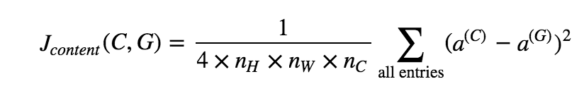
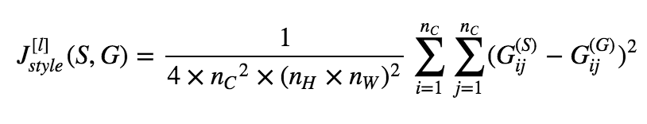

# Learning note 
## Neural network and deep learning
#### week1:
  * overall for neural network and deep learning.
  * interview to Geoffrey Hinton
#### week2:
  + Python basic
    + Avoid use for-loop or while loop in computation to some extend. Try best to make matrix computation.
    + Using numpy function to complete matrix/vector computation.
    + Matrix/vector operated by numeric would be "broadcasting"
  + 0-layer logistic regression(only a activation node) 
    + if just make a simple logistic regression, w and b can be initialized in "zero" vector. But for multi-layer neural network w can't be initialized as "zero". The reason would be introduced in next section.
    + Different learning rate would influence performance deeply.
#### week3: 
  * Implement a simple 1-layer NN
     - Compared with previous logistic regression, 1-layer NN can solve some non-linear separable problem.
     - W must be initialized by a random normal. It is because that assigning different weights to each node in hidden layer can trigger them to learn different decision boundary. If initializing zero or same weight to each weight, it would result to a balance where each node learns same decision boundary, and then the whole network would be same with only on node. 
          But, b can be initialized as "zero". Zero is related with training data.
      - The loss function is chosen as cross-entropy for logistic activation. Here, the square loss + logistic would become as a non-convex which has many local minima. 
      - Cost function = averaging(loss function). Cost function would involve in back-propagation. 
      - Learning rate, hidden layer size and number of nodes are hyper-parameter. Kinds of method can be used to choose them. Try them by your self.
#### week4:
- Deep neural network: step by step
    - The difference from shallow neural network is just using loop to finish forward and back propagation.
    - Cultivate yourself for a good writing habit. 
        - Superscript $[l]$ denotes a quantity associated with the $l^{th}$ layer.
            Example: $a^{[L]}$ is the $L^{th}$ layer activation. $W^{[L]}$ and $b^{[L]}$ are the $L^{th}$ layer parameters.
        - Superscript $(i)$ denotes a quantity associated with the $i^{th}$ example.
            Example: $x^{(i)}$ is the $i^{th}$ training example.
        - Lower-script $i$ denotes the $i^{th}$ entry of a vector.
            Example: $a^{[l]}_i$ denotes the $i^{th}$ entry of the $l^{th}$ layer's activations).

- Activation function choose:
    - Logistic regression: 
          Just for last layer for binary classification. Almost no ones choose it as activation function in hidden lay.
    -  Tanh: 
        better than logistic because the median point locates in right zero, but logistic locates in 0.5. 
    - Relu: 
        most used in current days. High speed even it is not differential, but still works well.There is a problem in "relu" that is named "dying relu". https://datascience.stackexchange.com/questions/5706/what-is-the-dying-relu-problem-in-neural-networks
    - Leaky relu: 
        just a transform for relu when w less than zero, multiply a small number to w.              
 
 		Don't be lazy and do by yourself.
## Hyperparameter_tuning, regularization and optimization
#### week1:
- Initialization
  - Zeros initialization
    - As said before, the symmetry can't be broken. all of nodes would be trained in same weight. Performance of it would very poor around 50%. The cost wouldn't get changed as long as iteration.
  - Random initialization
    - the parameters are initialized from normal distribution . The result would get better. After generate an array of parameter, it is better to multiply a small number like 0.01 to make parameter approach to zero.
  - Xavier initialization:
    - A substitute of small number is to scale it by layer size. 
      - Sigmoid/Tanh: sqrt(1./layers_dims[l-1])
      - Relu: sqrt(2./layers_dims[l-1])
  - Don't initialize to values that are too large.
- Regularization
  - L2-regularization
    - In cost function, add a item to the cost computation behind of the equation
        cost = cross_entropy_cost + L2_regularization_cost
    - In back_propogation, add a item to each layer of dw as W*lambd/m.
    - Increase the value of lambd would decrease the value of weight and reduce over-fitting of model.
  - Dropout
      - Normal dropout: In training phase, use dropout to randomly choose neutrons in hidden layers. In test phase, scale activation to original ones by multiplying dropout rate p.
      - Inverted dropout(common used): also use dropout proportion of hidden units, then divide by 1/p to restore the scale of units for next layer. In test time, **do nothing**.
- Gradient checking
  - Check correction of gradient for back-propagation
    - Use a approximate gradient to approach gradients computed by model. 
      $gradapprox = \frac{J^{+} - J^{-}}{2  \varepsilon}$
    - if the difference between approximate one and gradients computed is small enough (epsilon = 1e-7). It means the back-propagation would be correct and vice versa.
      $$ difference = \frac {\mid\mid grad - gradapprox \mid\mid_2}{\mid\mid grad \mid\mid_2 + \mid\mid gradapprox \mid\mid_2} \tag{2}$$
    - Gradient checking is slow, so we don't run it in every iteration of training. You would usually run it only to make sure your code is correct, then turn it off and use backprop for the actual learning process.
- Bias and variance:
  - In deep learning,no trade-off as other machine learning between bias and variance. Ones can decrease them separately. 
    - High variance(**over-fitting**): decrease the complexity of model.
      - add regularization
      - dropout
      - increase training set
    - High bias(**under-fitting**): increase the complexity of model.
      - increase size of layers 
      - increase size of units in each layer
#### week2
 + Optimization choices:
   * Mini-batch:
     - Small dataset(e.g. 2000): just use batch gradient decent
     - Large dataset: use mini-batch (64, 128, 256, 512)
   * Speed up for gradient descent:
     - Gradient descent with momentum:
       + Exponentially weighted averages: Bias in initial can be corrected  phase by using bias correction.
       + Momentum gradient decent is the method that gradient decent with exponentially weighted averages. The gradient oscillation in original gradient descent would be averaged. So the speed of that is faster than common gradient descent.
         
       + In practice, people don't use bias correction (Vdw/1-beta),because after 10 iteration, the moving average would warmed up and no longer the bias estimate.
       + The common choice of beta is 0.9.
     - RMSprop (Root mean square prop):
       + The vertical direction is represented by a and horizontal direction is w, RMSprop is aim to slow down variance of b and accelerate the speed of w.
   * Adam(adaptive moment estimation) optimization:
     - Momentum + RMSprop
     - Hyper-parameter

          |hyper-parameters |heuristic value| 
          | --------------  |:-------------:| 
          | alpha           | tuning        |
          | beta_monentum   | 0.9           | 
          | beta_RMSprop    | 0.999         |
          | epsilon         | $e^{-8}$      |
 + Learning rate decay:
   * There are many ways can adjust learning rate on line:
     - Exponentially decay
     - Stair decay
     - Square root decay
     - and so on...
 + Fundamental concept and experience:
   * **Iteration**: using data to update parameter one time that calls 1 iteration
   * **Epoch**: Using through entire data once in many times of iterations called 1 epoch.
   * **Batch gradient descent**: use all size of the data to update parameter. So here, 1 iteration equals 1 epoch. The parameters would be updated by k iterations (also k epochs)
   * **Stochastic gradient descent**: use 1 of data to update parameters once. So here, iteration would be m (size of data), and the parameters would be updated by m*k times.
   * **Mini-batch**: use a small batch of data to update parameter. So here, iteration would be m/mini-batch, and the parameter would be updated by k*m/mini-batch. 
 + Improve optimization:
   * Try better random initialization for weights
   * Use mini-batch
   * Use Adam-descent
     * Relatively low memory requirements (though higher than gradient descent and gradient descent with momentum)
     * Usually works well even with little tuning of hyper-parameters (except $\alpha$)
   * Tuning learning rate.
#### week3
   * Hyper-parameter tuning
     - Hyper-parameter:
       + Learning rate $\alpha$ (*****)
       + Momentum $\beta$
       + Adam: $\beta_{1}$, $\beta_{2}$, $\epsilon$
       + Number of layers
       + number of hidden units
       + Learning rate decay
     - Logarithm skill
   * Batch normalization
     - Normalizing activation:
       + Data normalization can make contour much rounder.
       + Normalize the value of not a but **z**.
       + It can make the training speed much faster.
       + $z_{norm}=(z_{old} - \mu)/\sigma$, $z_{new} = \alpha*z_{norm}+\beta$.
          
Here, parameter alpha and beta are controlling the distribution of z for each different activation unit.

       + $\beta$ and $\alpha$ can be learned as same as w and b.
       + Using batch normalization, the parameter of b would be helpless. because all the bias item would be eliminated by mean subtraction.
       + Activation normalizing can keep the distribution stable and avoid the covariate shift brought from value change in previous layer.
       + Practically, in test, for single test data, the mean and variance for each layer is computed from training mini-batch by exponentially weighted average. 
   * multi-class classification
     - Softmax activation and loss is $-\Sigma y_{i}log \hat{y_{i}}$
   * Frameworks:
     - Ease of programing
     - Running speed
     - Open source
   * Assignment notes:
      - The two main object classes in tensorflow are Tensors and Operators. 
      - When you code in tensorflow you have to take the following steps:
          - Create a graph containing Tensors (Variables, Placeholders ...) and Operations (tf.matmul, tf.add, ...)
          - Create a session
          - Initialize the session
          - Run the session to execute the graph
      - You can execute the graph multiple times as you've seen in model()
      - The back-propagation and optimization is automatically done when running the session on the "optimizer" object.
## Structuring machine learning projects
 #### week1
  * Motivating to ML strategy
      
      |data |model|regularization|optimization|
      | --------------  |:-------------:|:---:|:----:|
      | more data|bigger network|dropout |Longer GD|
      |  more diverse train set|small network|L2...|Adam|
      |  |more hidden units| | |
      |  |activation function| | |
  * Chain of assumption in ML
    - Fit on training set --> dev set --> test set --> real world
    - Experienced persons always know how to improve the model when they suffer form poor results in different occasions.
    - For orthogonalization, not to use early stopping. 
  * Set up training/dev/test set
    - it is important to choose **dev** and **test** from same distribution which must be taken randomly from all the data.
  * Bayes optimal error: best possible error
  * In some applications such as image recognition, human error can be regarded as Bayes optimal error approximately. In one hand, if the training set is relatively far from it, it means the model is still under-fitting.In another hand, if the training error is close to the human error, alter to decrease dev error but not training error.
  
    |diff of train&human >|diff of train&dev >| 
    | --------------  |:-------------:| 
    | bias deduction  | variance deduction
    | high bias           | high variance        |
    | under-fitting   | over-fitting           | 
    | change hyper-para    | regularization        |
    | enlarge model    | reduce model      |
    |try training longer| add training set|
 #### week2
  * Error analysis
    - Deep learning algorithm are quite robust to random error in the training set but not robust to the systematic error.
    - Metric of fixing the miss-label in dev/test set is the percent of miss-labeled data in all the dev/test set.
      + Apply same method to process dev and set to make them have same distribution.
      + Consider examining examples your algorithm got right as well as the ones it got wrong.
      + Perhaps, the training set and dev/test set come slightly from different distribution.
  * Mismatched training and dev/test set
    - Training set and dev/test set are on the different distribution:
      + Don't mix and shuffle the training set and dev/test set. Just keep the original distribution of training set. But put half of dev/test set into training set, and the left half part of dev/test set would be in another same distribution. DL algorithm is strong to processing the training set with different kinds of distribution over the long term.
    - How to choose to parts of dataset to lean?
      + If the training set and dev set come from different distribution, we can't say high variance/bias we have got any longer.
      + Make a small part of training-dev set, then observer the error different on training set and training-dev set.
      + The error different between training-dev and dev set is big, it means data mismatch problem.
    - DL algorithm is easy to over-fit on the subset of all the data.
  * Learning from multiple tasks:
    - Transfer learning:
      + By means of structure and parameters of the other model, if you have large size of training data for the new task, you can retrain all the parameters initializing with previous parameters. If the training set of new task is small, just retrain the last layer.
      + Two concepts: 
        * Pre-training: the parameters from previous model.
        * Fine-tuning: the parameters retrain from pre-training.
      + When transfer learning makes sense.
        * Task A and B have the same input x.
        * You have a lot more data for task A than task B.
        * Low level features from A could be helpful for learning B.
    - Multiple tasks learning:
      + When multi-task learning make sense:
        * Training on a set of tasks that could benefit from having shared lower-level features.
        * Amount of data you have for each task is quite similar.
        * Can train a big enough neural network to do well on all the tasks.
  * End-to-end learning:
    - The training models are chosen based on size of training set.
    - End-to-end methods can work well on large data set.
    - Pros and cons:
      + Pros:
        * Let the data speak
        * less hand-designing of components needed
      + Cons:
        * May need large amount of data
        * Excludes potentially useful hand-designed components.

## Convolutional Neural Network
#### week1
  * Learning objectives:
    - Understand the convolution operation
    - Understand the pooling operation
    - Vocabulary used in CNN(Padding, stride, filter....)
  * 卷积神经网络基本概念
    - Computer Vision
    - Edge Detection（Filter基本操作）
      + 使用一个NxN的矩阵作为filter/kernel逐行逐列的扫描数据矩阵
      + 可以使用特别的filter去探测vertical_edge或者horiontal_edge(有很多矩阵的配置可以选择)
      + 也可以作为参数去学习filter中各个位置的值，并通过反向传播算法来求出它们。
      + 也可以学出各种角度的edge
    - Padding基本操作
      + 问题: 在经过多层卷积之后，处于图像边缘的信息将会丢失。
      + 解决方法： 在图像的外侧填充一些像素，这个填充就是padding
      + Valid卷积：没用padding
      + Same卷积：输出数据和输入数据有相同的size p_size = f_size-1/2
      + 优点：
        * 防止数据缩水
        * 位于边缘的数据由于padding的存在也能够多次采样
    - Stride基本操作
      + output_size = (n_size+2*p_size-f_size)/2+1
      + 如果算出size不是整数，就做floor操作
    - Convolutions over volume（超过两维以上的卷积）
      + filter的channel和输入数据的channel维度相同
    - One of layers of convolutional network
      + 跟标准的神经网络对比，卷积神经网络的输入对应标准神经网络的输入，卷积层的filter相当于权重weight。然后wx+b可以经过一次非线性的变化（relu...)。这就是一个标准神经网络的结构。所以可以使用反向传播来进行优化。
    - Simple Convolutional network example
      + 输入矩阵的size在不断的变小，filter的数量（channels）的size在逐渐的增大。
      + 典型的卷积神经网络通畅有三层(convolution, pooling, fully-connected)
      + pooling层和fully-connected层比convolution层更容易设计。
    - Pooling layers
      + 优点：减少模型大小，提高计算速度。增加提取特征的鲁棒性。
      + Max pooling
        * 使用固定的size去filter和stride作为超参数。（常用选择，（2，2）/(3,2)）
      + Average pooling:并不是特别常用。
      + 在pooling技巧中很少使用padding 
    - CNN example
      + 卷积神经网络的层计算：
        * 一个conv层+一个pooling层被称为一层。统计具有权重和参数的层叫做一层。
        * 在几层C+V的叠加之后，进行fully-connected操作。
        * 尽量不要自己设置超参数，看别人的文章来选择超参数。
        * 数据的size的增加，数据size会不断减少。同事channel的size在不断的增加。
    - Why convolutions
      + 使用卷积神经网络的优点：
        * parameter sharing and sparsity of connections.
#### week2
  * Learning objectives:
    - Understand foundational papers
    - Analyze the dimentionally reduction of a volume
    - Residual network
    - Skip-connection
  * Deep convolutional models: case studies
    - Classic networks(n_h & n_w (down), n_c(up) )
      + LeNet:
        * 非常基本的卷积神经网络 data->conv->avg_pool->conv->avg_pool->fully_con->y
      + AlexNet:
        * input->conv->max-pool->conv->max-pool->conv-conv-conv-max-pool-fully-con-softmax
      + VGG-16:
        * input->conv(same-padding)->pool->conv(same-padidng)->pool->conv(same-padding)->....(3 times)_>_FC->FC->softmax
    - ResNets:
      + 必须是same-padding的网络才可以进行skip-connection.
      + 直接copy两层以前的a到当前的激活函数中，a**[l+2] = g(z**[l+2]) 变成了 a**[l+2] = g(z**[l+2]+ a**[l]). 这样可以避免在层数过深的情况前产生的gradient decay/explode. 这也叫做skip-connection.
      + 在residual不足的情况下，随着网络的加深，training_error会在达到一点的低点后随着网络的加深变大。但是在加入residual的网络中，随着层数的加深training_error会一直不断的减小。有研究者在1000多层的深度网络中做过实验。
    - Networks in networks(1x1 convolution):
      + 在channel比较多的输入中1x1的filter会有比较好的作用。原因就是使用1*1的filter在数据上扫描将会把数据在channel上的n维vector输出到real_number, 如果使用很多个filters相当于对输入的每个在channel向的所有slices做了fully-connected.
    - Inception network
      + 自动选择filter维度已经决定是否需要使用卷子层或者池化层。简单来说，在输入之后的层里叠加各种想要使用的conv维度或者pooling技术，然后在一层中将他们pack起来的技术。
      + 由于计算成本非常高，这里可以引入1x1conv的技术来降低参数的规模。一般来说可以把参数的个数降低一个数量级。使用方法，在原来的输入层和卷积层中间加入1x1conv。这个层一般被称为"bottleneck layer"。
      + 具体例子：
        * input: 28*28*192
        * input-> 1x1 conv = 28*28*64
        * input-> 1*1 conv-> 3*3 conv = 28*28*128
        * input-> 1*1 conv-> 5*5 conv = 28*28*32
        * input-> 3*3 pooling-> 1*1 conv = 28*28*32
      + 之后将这些子channel累加起来28*28*(64+128+32+32)
      + 同样这样的结构可以被扩展到multiple-layer[Szegday,2014: Going deeper with convolutiona]
  * Advices for using ConvNets
    - Open-source implementaion
      + 下载实现别人的project并且贡献自己的project.
    - Transfer learning
      + 如果有很少数据的情况下，使用开源已经训练好的weight并且freeze这些已经训练好的参数和层，然后在后面加入自己需要层。
      + 数据量很大， 可以冻结其中一部分层的weight,更新另一部分的weight。
      + 也可以把weight当做初始化，使用新数据去更新它们。
    - Data Augmentation
      + 垂直镜像，随机修剪，旋转，扭曲
      + color shifting
      + 多线程每个处理不同的augment方法并且作为mini_batch.
#### week3
  * Learning objectives:
    - Object localization, object detection and landmark finding
	- Non-max suppression
    - intersection over union
    - Label a dataset
    - Vocabulary(Landmark, anchor, bounding box, grid)
  * Detecion algorithm
    - Object localization and  Object detection
	  + 想分类并且识别图像，首先要识别图像中的物体。
	  + 以自动驾驶为例，图像中可能包含objects为：行人，汽车，摩托车，背景等等。
	  + 为了确定图片中的对象，分类器的最后一层比如softmax可以被设计为输出对象标签和图像组物体位置的上下左右四个特征（bx:物体中心位置在整个图片横坐标的比例，by：物体中心位置在整个纵坐标的具体位置，bh：物体高度跟整个图片高度的比例，bw：物体宽度和真个图片宽度的比例）
	  + 识别图像中局部存在的object，可以是unique object recognition也可以是multiple objects recognition。
   	  + loss function可以根据数据y的具体情况进行选择。可以对输出为1/0的纬度使用logistic，对输出为numerical的维使用squareloss，可以对多维1/0的使用neg_log_likelihood_loss。
    - Landmark finding
	  + 可以在图片中设置一些landmark特征，比如眼睛的位置，眼睛的轮廓或者嘴巴的轮廓，这些特征可以作为判定人脸表情的features。
	  + 这样的方法还可以被用于识别物体的姿态。
    - Object detection
	  + 使用一个窗口slide去扫面整个图片，对于任何一个window都是用convnet去识别窗口种是否包含要识别的对象（例：汽车识别的问题，训练集需要准备跟窗口大小一样的汽车图片）。每个被扫描的window都相当于一个识别问题。
	  + coarse granularity的扫描会使识别准确度降低，因为有些对象物体并不都能被完全的扫描到窗口里。find granularity的方法由于skip step太多造成计算成本的上升。
    - Convolutional implementation of sliding windows
		+ 将全连接层转化为卷积层
		+ 通过将全连阶层更改为卷积层，例如在全连接层选择5x5的window，全连接的filter的个数仍然为原始全连接层的维度。[Paper: overfeat: integrated recognition, localization and detection using convolutional networks]
		+ 缺点：边框的位置不准确
    - Bounding box predictions
		+ YOLO算法(you only look once) 
		+ 将输入数据x映射为grid_cells(n_grid*n_grid*n_y),n_grid代表网格的维度，n_y代表输出y维度。
		+ objects备份配到某一个grid的根据是，object的中心坐标落在哪一个格子中。
		+ 由于使用卷积结构，计算效率非常高。可以进行real-time的object recognition处理。
    - intersection over union
		+ 这个方法可以用来评价对象检测算法。
		+ 计算方法：（探测边框面积 交 真实对象边框面积）／UNION面积>=threshold
    - Non-max suppression
		+ 这个方法保证检索算法对每个对象只检测一次。
		+ 具体做法：先找到对object检测具有最大概率的box。然后Non-max suppression将会去寻找和当前box具有最大IoU的boxes，然后一直剩下这些boxes的输出。
    - Anchor boxes
		+ 让一个box检测多个objects
		+ 在一个输出y的向量中叠加多次可能探测的对象的输出Y~{y1,y2,...yn}
		+ 这个方法会让算法具有更高的针对性（例如要探测的图像中的objects具有瘦高或者横宽特性）。
    - YOLO algirithm
	- Region proposal(YOLO之前的传统方法)
		+ R-CNN: 这个概念会在很多的物体检测的文献中出现。
		+ 先检测出有意义的区域，然后针对这些区域进行卷积。而不是对整个图片的所有区域进行卷积。
		+ Segmentation algorithm
#### week4
  * Face recognition
    - One shot learning
		+ 人脸识别是一个比较难的问题，就是因为人脸识别要解决的是一个one-shot识别问题。就是在只有一个训练sample的情况下解决识别问题。
		+ learning similarity function:
			+ f(img1, img2) = degree of difference between images.
			+ if f(img1, imags) <= threshold
    - Siamese network
		+ Paper: [deepface]
		+ 把两个图片输入给相同结构神经网络，神经网络会输出对应两个图片的vector。这个步骤叫做encoding。然后比较这两个encoding。
		+ loss function: 
			+ if two images are same person, ||encoding_img1- encoding_img2||^2 is small
			+ if two images are difference person, ||encoding+img1 - encoding_img2||^2 is large.
    - Triplet loss
		+ Paper: [facenet 2015]
		+ 通常情况下会让objective函数同时看三张图片: Anchor, positve和negative。
		+ ||encoding_Anchor - encoding_Positive||^2 - ||encoding_Anchor - encoding_Positive|| + alpha <= 0。这里alpha被称作margin（和svm中的margin有一样的意义）。 
		+ max(||encoding_Anchor - encoding_Positive||^2 - ||encoding_Anchor - encoding_Positive|| + alpha, 0)
		+ 为了使分类器获得更好的效果，就需要使||encoding_Anchor - encoding_Positive||^2 约等于||encoding_Anchor - encoding_Positive||。论文中有更详细的介绍。
		+ 可以寻找一些已经训练好的参数（transfer learning）
    - Face verification and binary classification
		+ 可以把两个图片最后的encoding输出看作使binary_classification问题。最后一层的输出使用sigmoid函数。
			+ objective_function y_hat = sigmoid(sum(w_i*|encoding(x_i)_k-encoding(x_j)_k|))
  * Neural style transfer
    - Deep ConvNets learning
		+ Paper:[A neural algorithm of artistic style]
	- Cost function
		+ Loss function = alpha\*Loss_content(content_image, generate_image) + beta\*loss_style(style_image, generate_image)
		+ 使用gradient descent去最小化loss_function
    - Content cost function
		+ content_cost的输入是卷积神经网络某个隐藏层的激活。cost比较原始a_content和生成图像激活a_G的不同。
		+ content_cost的作用就是确保生成图像和原始图像尽可能的相似。
		
    - Style cost function
		+ 计算style_matrix（n_channel x n_channel), 每一维就是channel和channel之间的correlation。
		+ loss_funtion = ||G_style - G_generate||^2
		
    - 1D and 3D generalizations
## Lecture5
#### week1
  * Recurrent neural networks
    - Notation
    - RNN model
    - Backpropagation through time
    - Different types of RNNs
    - Language model and sequence generation
    - Sampling novel sequences
    - Vanishing gradients with RNNs
    - Gated Recurrent Unit(GRU)
    - Long short term memory(LSTM)
    - Bidirection RNN
    - Deep RNNs
#### week2
  * Word embedding
    - Word representation
    - Using word embeddings
    - Properties of word embeddings
    - Embedding matrix
  * Learning word embedding: Word2vec&Glove
    - Learning word embeddings
    - Word2vec
    - Negative sampling
    - Glove word vectors
  * Application using word embeddings
    - Sentiment classifications
    - Debiasing word embeddings
#### week3
  * Various sequence to sequence architectures
    - Basic models
    - Picking the most likely sentence
    - Beam search
    - Refinements to Beam search
    - Error analysis in beam search
    - Bleu score
    - Attention model intuition
    - Attention model
  * Speech recognition
    - Speech recognition
    - Trigger word detection
## 常见知识点：
  * gradient saturation（https://www.quora.com/Why-would-a-saturated-neuron-be-a-problem）:
    - 梯度饱和问题: 在神经网络中，经常选择sigmoid或者tangent作为激活函数。这两种激活函数的作用都是把一个infinite的值映射到finite的范围中去。输入输出不能保证在一个范围内，激活输出被压缩到了一个固定的区间内。如果input和weight使激活的output接近于边界的情况就被称作饱和。这种情况将会导致在反向传播的时候曲线的梯度接近于0.
    - 解决方法：
      + 选择non-saturation的激活函数
      + 加入regularization（dropout, l2, sparsity等等）

(latex math viewer: https://chrome.google.com/webstore/detail/github-with-mathjax/ioemnmodlmafdkllaclgeombjnmnbima/related)
